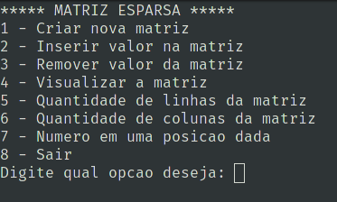

# Matriz_Esparsa
### Matriz alocada dinamicamente

Trabalho desenvolvido na Disciplina de Técnicas de Programação do 1º Ano de Ciência de Computação da UEL.

## Sobre

Matrizes esparsas são matrizes nas quais a maioria das posições é preenchida por zeros. Para essas matrizes, podemos economizar um espaço significativo de memória se apenas os termos diferentes de zero forem armazenados.

No momento em que se insere um valor na matriz, é alocado um espaço dinâmicamente na memória e preenchido com o valor.

Nesse trabalho conseguimos desenvolver habilidades de lógica, trabalhar com alocação dinâmica, lista simplesmente encadeada unindo tudo isso ao conceito de uma matriz esparsa.

## Interface com o usuário

A interface com o usuário é bem simples contendo as opções oferecidas pelo programa.



## Para utilizar 

Para baixar e utilizar o programa siga as instruções.

### Pré-requisitos
Para rodar o programa precisamos de um compilador para a linguagem C instalado na máquina.
O compilador utilizado no desenvolvimento desse programa foi o GCC.

**As instruções a seguir são para o sistema operacional Linux utilizando seu terminal.**

* Instalando gcc e make
  ```sh
   sudo apt update
   sudo apt install build-essential
  ```

### Instalando e executando 

1. Clone o repositório:
   ```sh
   git clone https://github.com/wellintonpiassa/Matriz-Esparsa.git
   ```
2. Go to the repo's root directory and choose the assignment part to be runned, for example:
   ```sh
   cd Matriz-Esparsa/
   ```
3. Compile o programa:
   ```sh
   make
   ```
4. Rodando o programa:
    ```sh
   ./main
   ```
